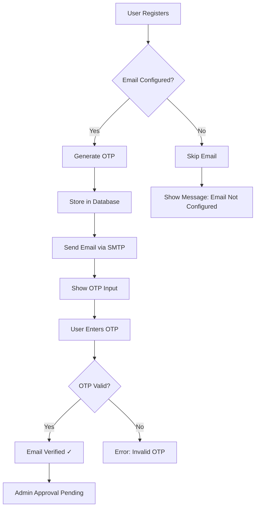

# 🔧 Email Verification Setup - Quick Start

## ⚠️ Problem: OTP Not Being Sent to Email

The email verification system requires **SMTP credentials** to send OTP emails. Without proper configuration, the system will skip sending emails.

## ✅ Solution (3 Steps)

### Step 1: Get Gmail App Password

1. Go to https://myaccount.google.com/apppasswords
2. Enable 2-Factor Authentication if not already enabled
3. Create an App Password for "Mail"
4. Copy the 16-character password (example: `abcd efgh ijkl mnop`)

### Step 2: Update .env File

Open `/workspace/.env` and add your credentials:

```env
# Replace these with YOUR actual Gmail credentials
SMTP_USER=your-email@gmail.com
SMTP_PASSWORD=abcdefghijklmnop
SMTP_FROM_EMAIL=your-email@gmail.com
SMTP_FROM_NAME=PCMT Smart Exam System
```

**Important:** Remove spaces from the app password (use `abcdefghijklmnop` not `abcd efgh ijkl mnop`)

### Step 3: Restart Backend

```bash
# Stop any running backend
pkill -f "uvicorn|python.*app"

# Start backend
cd /workspace
python start_backend.py
```

## 🧪 Test Email Sending

```bash
python test_registration_flow.py your-email@gmail.com
```

## 📋 How It Works



## 🔍 Debugging

Check backend logs for these messages:

- ✅ `✅ OTP sent successfully to user@example.com` - Email sent!
- ⚠️ `⚠️ Email service not configured` - Need to add SMTP credentials
- ❌ `❌ Failed to send OTP` - Check SMTP credentials/network

## 🆘 Common Issues

| Issue | Solution |
|-------|----------|
| "Authentication failed" | Use App Password, not regular password |
| "Connection timeout" | Check firewall, try port 465 instead of 587 |
| Email goes to spam | Add sender to contacts, check SPF/DKIM |
| No email received | Check spam folder, verify email address |

## 📖 More Help

See `EMAIL_SETUP_GUIDE.md` for detailed troubleshooting.
